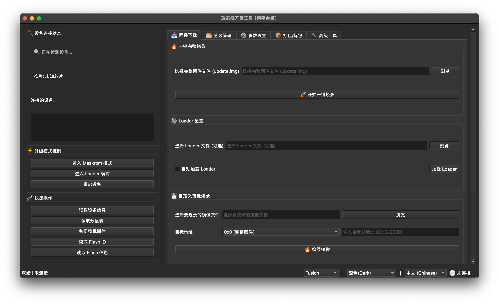

## RKDevelopTool GUI

### 项目介绍 | Project Introduction

**RKDevelopTool GUI 是 Rockchip 官方 rkdeveloptool 的图形化前端。**

**RKDevelopTool GUI is a graphical front-end for Rockchip's official rkdeveloptool.**

👉 项目Github主页｜ Project Github homepage : [https://gahingwoo.github.io/RKDevelopTool-GUI/](https://gahingwoo.github.io/RKDevelopTool-GUI/)

由于目前市面上缺乏适用于 macOS 和 Linux 系统的、功能完善且易于使用的 rkdeveloptool gui 工具，因此我特此开发了这款跨平台的图形化界面软件。  
As there is currently a lack of fully-featured and user-friendly rkdeveloptool gui tools for macOS and Linux, so I have developed this cross-platform graphical interface application.

  
*RKDevelopTool GUI 主界面*

  
*RKDevelopTool GUI Main Interface*

本软件致力于提供一个直观、友好的用户界面，将复杂的命令行操作转化为简单的点击式交互，让固件烧录、分区管理和设备调试等任务变得更加高效和快捷。  
This software aims to provide an intuitive and user-friendly interface, turning complex command-line operations into simple click-based interactions, making firmware flashing, partition management, and device debugging more efficient and convenient.

**核心功能包括 | Key Features:**

* **设备状态实时监控：** 自动检测并显示已连接的 Rockchip 设备及其模式（Maskrom 或 Loader），方便您快速掌握设备状态。  
  **Real-time Device Monitoring:** Automatically detects and displays connected Rockchip devices and their modes (Maskrom or Loader), allowing you to quickly understand device status.
* **固件一键烧录：** 支持一键烧录完整的 `update.img` 固件，简化整个烧录流程。  
  **One-click Firmware Flashing:** Supports one-click flashing of complete `update.img` firmware, simplifying the entire flashing process.
* **分区灵活管理：** 能够读取设备分区表，并对特定分区进行单独的烧录、备份和擦除操作，满足高级用户的定制化需求。  
  **Flexible Partition Management:** Reads device partition tables and allows individual flashing, backup, and erasing of specific partitions for advanced customization.
* **升级模式切换：** 提供进入 Maskrom 和 Loader 模式、以及设备重启的快捷操作按钮。  
  **Upgrade Mode Switching:** Provides quick buttons to enter Maskrom and Loader modes, and to reboot the device.
* **日志与进度显示：** 实时显示命令执行日志和烧录进度条，过程透明，便于问题排查。  
  **Log and Progress Display:** Shows real-time command execution logs and flashing progress bars for transparency and easier troubleshooting.

### 风险提示 | Risk Notice

**本软件仅为 `rkdeveloptool` 命令行的图形化封装，所有操作均直接调用底层工具。固件烧录是一项具有风险的行为，不当的操作可能导致设备变砖或数据丢失。**  
**This software is only a graphical wrapper for the `rkdeveloptool` command-line tool. All operations directly invoke the underlying tool. Firmware flashing is risky and improper operations may cause device bricking or data loss.**

**作者不对任何因使用本软件而造成的设备损坏、数据丢失或任何其他直接/间接损失承担任何责任。**  
**The author is not responsible for any device damage, data loss, or any other direct/indirect losses caused by using this software.**

**请在使用前确保您完全理解所有操作，并对可能产生的后果负责。**  
**Please ensure you fully understand all operations and take responsibility for any possible consequences before use.**

### 系统依赖 | System Requirements

* **Python 3.x**
* **PyQt6：** 用于构建用户界面。  
  **PyQt6:** Used for building the user interface.
* **`rkdeveloptool`：** 核心依赖工具，请务必自行安装并配置到系统环境变量 `PATH` 中。  
  **`rkdeveloptool`:** Core dependency. Please install and configure it in your system environment variable `PATH`.
  * **安装教程地址 (rkdeveloptool)：** [https://docs.radxa.com/zero/zero3/low-level-dev/rkdeveloptool](https://docs.radxa.com/zero/zero3/low-level-dev/rkdeveloptool)  
    **Installation Guide of rkdeveloptool:** [https://docs.radxa.com/en/zero/zero3/low-level-dev/rkdeveloptool](https://docs.radxa.com/en/zero/zero3/low-level-dev/rkdeveloptool)
